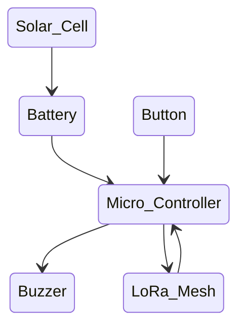

# First (simplest) Proof of Concept

To create a mesh network that can connect people together in an emergency, the device needs to be battery operated, rechargeable, and able to send and receive information (at the very least an emergency alert signal).

The simplest node structure could be something like this:



Turning on nodes in the Mesh, they should automatically connect.  Once connected, if I press the Button on one, it should sound the Buzzer on all the nodes at the same time.

With the PoC, we are testing the basic process of creating a LoRa Mesh, sending and receiving signals, and whether a battery can be charged sufficiently by the Solar Cell, and how long the battery will last.

## Components

The components I have purchased or raided my stores for are the following:

1) [Firebeetle ESP32-C6](https://www.dfrobot.com/product-2771.html)
   - This is a good, low power, general purpose Arduino compatible microcontroller, that has terminals for plugging in a battery and a solar panel, along with electronics to manage charging.  It is USB-C connected, and has the benefit of hvaing WiFi and Bluetooth connectivity as well.  Further, you can easily add a small screen, and of course plugin in a buzzer and a button.
2) [LoRa Mesh Radio Module(s)](https://www.dfrobot.com/product-1670.html)
   - Pre-programmed with MANET.  Will require being controlled via a serial connection, which the Firebeetle can manage.
3) [Solar Panel](https://www.dfrobot.com/product-1775.html)
   - It's a bit big, but suitable for the PoC.
4) [Rechargeable Battery](https://www.jaycar.co.nz/18650-samsung-3500mah-3-7v-18650-rechargeable-battery/p/SB2632)
   - These have to be sourced locally - Jaycar is the easiest.
5) [Screen for Firebeetle](https://www.dfrobot.com/product-2071.html)
   - Not essential, but can be useful for displaying what is going on internally.  Later, we might use an e-ink screen due to lower power requirements.

Are these the only components that would work?  No, not at all, and part of the challenge is to decide between the multiple possibilities on offer.

## Create a mesh network without LoRa

As a test, and to get things set up, try something with the screens, I thought it would be a good idea to try building a mesh network using just WiFi.  This code does just that.  For each node that joins the network, the screen blinks an extra blink.


This all works well so far.


```c
//************************************************************
// this is a simple example that uses the easyMesh library
//
// 1. blinks led once for every node on the mesh
// 2. blink cycle repeats every BLINK_PERIOD
// 3. sends a silly message to every node on the mesh at a random time between 1 and 5 seconds
// 4. prints anything it receives to Serial.print
//
//
//************************************************************
#include <painlessMesh.h>
#include <DFRobot_GDL.h>

#define TFT_DC D2
#define TFT_CS D6
#define TFT_RST D3

DFRobot_ST7789_240x320_HW_SPI screen(/*dc=*/TFT_DC, /*cs=*/TFT_CS, /*rst=*/TFT_RST);

// some gpio pin that is connected to an LED...
// on my rig, this is 5, change to the right number of your LED.
#ifdef LED_BUILTIN
#define LED LED_BUILTIN
#else
#define LED 2
#endif

#define   BLINK_PERIOD    3000 // milliseconds until cycle repeat
#define   BLINK_DURATION  150  // milliseconds LED is on for

#define   MESH_SSID       "Reality2"
#define   MESH_PASSWORD   "reality2"
#define   MESH_PORT       5555

// Prototypes
void sendMessage(); 
void receivedCallback(uint32_t from, String & msg);
void newConnectionCallback(uint32_t nodeId);
void changedConnectionCallback(); 
void nodeTimeAdjustedCallback(int32_t offset); 
void delayReceivedCallback(uint32_t from, int32_t delay);

Scheduler     userScheduler; // to control your personal task
painlessMesh  mesh;

bool calc_delay = false;
SimpleList<uint32_t> nodes;

void sendMessage() ; // Prototype
Task taskSendMessage( TASK_SECOND * 1, TASK_FOREVER, &sendMessage ); // start with a one second interval

// Task to blink the number of nodes
Task blinkNoNodes;
bool onFlag = false;

void setup() {
  Serial.begin(115200);
  screen.begin();
  screen.fillScreen(COLOR_RGB565_GREEN);

  pinMode(LED, OUTPUT);

  mesh.setDebugMsgTypes(ERROR | DEBUG);  // set before init() so that you can see error messages

  mesh.init(MESH_SSID, MESH_PASSWORD, &userScheduler, MESH_PORT);
  mesh.onReceive(&receivedCallback);
  mesh.onNewConnection(&newConnectionCallback);
  mesh.onChangedConnections(&changedConnectionCallback);
  mesh.onNodeTimeAdjusted(&nodeTimeAdjustedCallback);
  mesh.onNodeDelayReceived(&delayReceivedCallback);

  userScheduler.addTask( taskSendMessage );
  taskSendMessage.enable();

  blinkNoNodes.set(BLINK_PERIOD, (mesh.getNodeList().size() + 1) * 2, []() {
      // If on, switch off, else switch on
      if (onFlag)
        onFlag = false;
      else
        onFlag = true;
      blinkNoNodes.delay(BLINK_DURATION);

      if (blinkNoNodes.isLastIteration()) {
        // Finished blinking. Reset task for next run 
        // blink number of nodes (including this node) times
        blinkNoNodes.setIterations((mesh.getNodeList().size() + 1) * 2);
        // Calculate delay based on current mesh time and BLINK_PERIOD
        // This results in blinks between nodes being synced
        blinkNoNodes.enableDelayed(BLINK_PERIOD - 
            (mesh.getNodeTime() % (BLINK_PERIOD*1000))/1000);
      }
  });
  userScheduler.addTask(blinkNoNodes);
  blinkNoNodes.enable();

  // randomSeed(analogRead(A0));
}

void loop() {
  mesh.update();
  digitalWrite(LED, !onFlag);
}

void sendMessage() {
  String msg = "Hello from node ";
  msg += mesh.getNodeId();
  msg += " myFreeMemory: " + String(ESP.getFreeHeap());
  mesh.sendBroadcast(msg, true);

  if (calc_delay) {
    SimpleList<uint32_t>::iterator node = nodes.begin();
    while (node != nodes.end()) {
      mesh.startDelayMeas(*node);
      node++;
    }
    calc_delay = false;
  }

  Serial.printf("Sending message: %s\n", msg.c_str());
  
  taskSendMessage.setInterval( random(TASK_SECOND * 1, TASK_SECOND * 5));  // between 1 and 5 seconds
}


void receivedCallback(uint32_t from, String & msg) {
  // screen.fillScreen(COLOR_RGB565_GREEN);

  Serial.printf("startHere: Received from %u msg=%s\n", from, msg.c_str());
}

void newConnectionCallback(uint32_t nodeId) {
  // Reset blink task
  onFlag = false;
  blinkNoNodes.setIterations((mesh.getNodeList().size() + 1) * 2);
  blinkNoNodes.enableDelayed(BLINK_PERIOD - (mesh.getNodeTime() % (BLINK_PERIOD*1000))/1000);
 
  Serial.printf("--> startHere: New Connection, nodeId = %u\n", nodeId);
  Serial.printf("--> startHere: New Connection, %s\n", mesh.subConnectionJson(true).c_str());
}

void changedConnectionCallback() {
  Serial.printf("Changed connections\n");
  // Reset blink task
  onFlag = false;
  blinkNoNodes.setIterations((mesh.getNodeList().size() + 1) * 2);
  blinkNoNodes.enableDelayed(BLINK_PERIOD - (mesh.getNodeTime() % (BLINK_PERIOD*1000))/1000);
 
  nodes = mesh.getNodeList();

  Serial.printf("Num nodes: %d\n", nodes.size());
  Serial.printf("Connection list:");

  SimpleList<uint32_t>::iterator node = nodes.begin();
  while (node != nodes.end()) {
    Serial.printf(" %u", *node);
    node++;
  }
  Serial.println();
  calc_delay = true;
}

void nodeTimeAdjustedCallback(int32_t offset) {
  Serial.printf("Adjusted time %u. Offset = %d\n", mesh.getNodeTime(), offset);
}

void delayReceivedCallback(uint32_t from, int32_t delay) {
  Serial.printf("Delay to node %u is %d us\n", from, delay);
}
```
