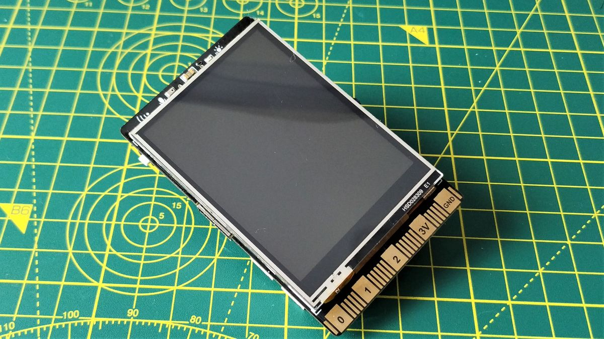
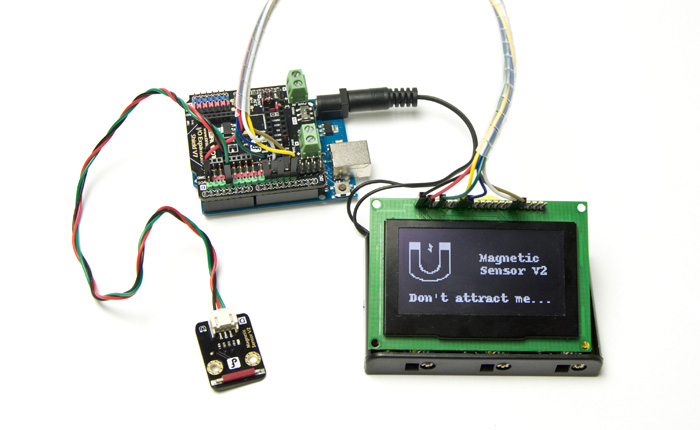

# Where to get components

There are many places to buy electronics components, mostly international, but sometimes there are local suppliers as well.  In New Zealand (where I am based), for example, [Jaycar](https://www.jaycar.co.nz) is one option.  There are several online shops with local (NZ) addresses, but they tend to be store-fronts for international organisations.  [Digikey](https://www.digikey.co.nz/), [Element14](https://nz.element14.com/) and [RadioShack](https://nz.rs-online.com/web/) are a few to check out.

One international site I find particularly inspiring is [DFRobot](https://www.dfrobot.com), often a great place to peruse for inspiration.  And, of course, there is [Aliexpress](https://www.aliexpress.com) where you can find almost anything.

## How do I know what to get?

If you are starting out in the electronics maker space, then it can be overwhelming to know what components to get.  Below are a few tips.  However, the best source of information is to get out onto your favourite search engine, have some discussions with your favourite AI, and see what you can find and learn.  Once you have a general understanding, actually making something is then important to developing that understanding further.  Also, follow the work on these pages - hopefully they will be instructional.

The core structure of any device is roughly similar.  You will need a processor, sensors and actuators.

### Processors

The processor is programmed to take in the information from the sensors, and produce some output on the actuators.  You might also have human input and output devices such as screens, buttons, microphones, cameras, alarms, speakers etc.  Further, you may have some connectivity devices like wifi or bluetooth.

Processors can be divided into two rough classes:

1) Microcontrollers - most often [Arduino](https://www.arduino.cc/) compatible.  These can run simple programmes, generally do one thing at a time, are low powered, have little memory, but are very efficient in power usage.

2) CPUs - for more intensive applications where more complex processing is required, a more complete Central Processing Unit is needed.  There are many to choose from, but one that is popular is the [Raspberry PI](https://www.raspberrypi.com/) range.

Another that is popular is the [unihiker](https://www.dfrobot.com/search-unihiker.html), which comes with builtin touch screen, several sensors, a USB-A plug, and other plugs for sensors.

How do you know which to get?  Generally, if the task requires relatively simple processing, such as sending of sensed data to other places, and where low power consumption is important, then microcontrollers are probably the best to use.  If you need to do more complex processing (eg AI analysis of data), then a CPU (possibly with an NPU - neural processing unit), is likely the best option.  Though powering it will become more of an issue.

It is common to create systems with a combination of devices - low powered microcontrollers to read and pass on data, CPUs (perhaps with NPUs) to work with that data.  This is the model used with the Wairoa project.

### Sensors

If you want to know what is happening in the real world, you need some form of sensor.  There are sensors for just about anything you can imagine, from biometrics, such as heart rate and skin conductivity, to environmental, such as dissolved oxygen in water, or pH level, to intelligent, such as an AI driven camera to recognize objects. 

Sensors tend to range in price from a few dollars to many thousands of dollars.  The complexity of the device, its durability and how precise it is, affect the price.

### Actuators

Actuators do stuff to the environment.  Usually these are motors, but you may find relay switches, linear actuators, heating elements, etc.  You can even include various noise makers such as speakers, alarms and buzzers.

### Starter Kits

Often a good way to begin is to get a kit.  There are many to choose from, for example on [DFRobot](https://www.dfrobot.com/search-sensor-kits.html).  Further, many places offer specially configured sensors that are easy to put together, often just plugging into the controller.  One such is the [Gravity](https://www.dfrobot.com/search-gravity.html) range of devices.

Then, there are a myriad of sites where you can find projects to tackle, discussion forums and so forth.  The main thing is to get in there and give it a go.