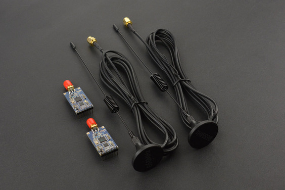

# Why LoRa Mesh?
LoRa stands for Long Range.  There are [specfic frequencies available in countries](https://meshtastic.org/docs/configuration/radio/lora/) around the world that are open for these kinds of communications.  Make sure you purchase equipment with the correct frequencies for your country.

There are numerous sites that describe the different types of LoRa, what they can be used for, how they work, and so forth.  So, we won't cover that here.  One that I have found helpful is t[hethingsnetwork.org](https://www.thethingsnetwork.org/).

## LoRa Mesh

Different configurations of LoRa are suitable for different applications.  For this project, we want to be able to connect people and homes in an adhoc manner, sending the same information to each, and be able to expand the network over larger distances than pairs of LoRa transeivers can manage by themselves.  LoRa can be configured in point-to-point, hub-and-spoke and mesh topologies.

## Routing and Bandwidth

A mesh topology would seem to match the design requirements, however does bring complications and limitations.  Routing information from one place on the network to another needs to be managed, and the already limited bandwidth of the LoRa network will be further reduced managing this propogation of information.

## Resources

There is a __lot__ of information out there on the Internet about how to build LoRa Mesh networks.  For example [this one](https://nootropicdesign.com/projectlab/2018/10/20/lora-mesh-networking/) goes through the core principles quite nicely.

But, most importantly, you need to buy the correct devices to begin with.  For example, [this looks to be quite suitable](https://www.dfrobot.com/product-1670.html).  Note, we are not endorsing any specific products, but rather sharing what we have learned so far.  This has inbuilt [MANET](https://www.geeksforgeeks.org/introduction-of-mobile-ad-hoc-network-manet/) protocols, greatly simplifying the work to be done.

